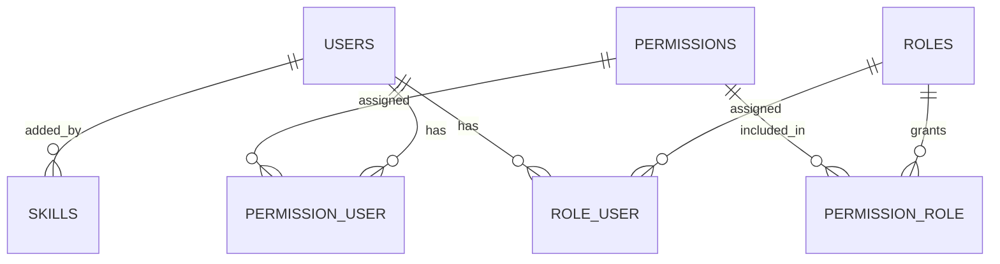
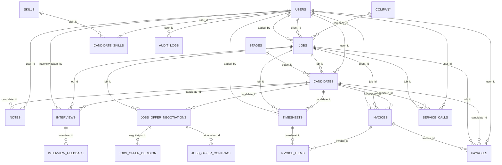

# Staffingo CRM - Schema Dictionary and ERD

This document provides:
- Table-by-table schema dictionary (key business tables)
- Strict FK-only relationship map (what is truly enforced in DB)
- Logical relationship map (what the app likely uses by convention)
- Mermaid ERD blocks for both views

---

## 1) Table Dictionary (Key Business Tables)

| Table | Purpose | Important Columns | Notable Keys / Constraints |
|---|---|---|---|
| `users` | Core identity for all actors (admin, account manager, client, candidate) | `name`, `email`, `username`, `is_candidate`, `is_account_manager`, `is_client`, `company_id`, `added_by`, `tenant_id` | PK `id`; unique `email`; unique `username`; `added_by` declared as `foreignId` but not constrained |
| `roles` | RBAC role definitions | `name`, `is_admin_role` | PK `id`; unique `name` |
| `permissions` | RBAC permission definitions | `name` | PK `id`; unique `name` |
| `role_user` | User-role pivot | `role_id`, `user_id` | Composite PK (`role_id`,`user_id`); enforced FKs to `roles.id`, `users.id` |
| `permission_role` | Role-permission pivot | `permission_id`, `role_id` | Composite PK (`permission_id`,`role_id`); enforced FKs to `permissions.id`, `roles.id` |
| `permission_user` | Direct user-permission pivot | `permission_id`, `user_id` | Composite PK (`permission_id`,`user_id`); enforced FKs to `permissions.id`, `users.id` |
| `company` | Company/client organization profile | `name`, `email`, `phone`, `industry_type`, `added_by`, `country`, `city`, `province` | PK `id`; no enforced FK constraints |
| `jobs` | Job requisitions and operational fields | `title`, `job_contract`, `type_id`, `location_id`, `pipeline_id`, `company_id`, `client_id`, `skills` (json), `added_by`, `job_status`, `resume_deadline` | PK `id`; unique `title`; unique `job_contract`; indexes on `company_id`,`client_id`,`added_by`; no enforced FKs |
| `candidates` | Candidate-job pipeline state record | `user_id`, `job_id`, `stage_id`, `email`, `resume` | PK `id`; no enforced FKs (commented FK intent in migration) |
| `stages` | Pipeline stage definitions | `pipeline_id`, `name`, `order`, `is_default`, `actions` | PK `id`; no enforced FKs |
| `categories` | Generic hierarchical taxonomy | `parent_id`, `name`, `key`, `slug`, `order`, `meta` | PK `id`; indexes `key`,`slug` |
| `notes` | Candidate notes and visibility state | `user_id`, `candidate_id`, `note`, `is_private`, `added_by` | PK `id`; no enforced FKs |
| `skills` | Skill master list | `name`, `added_by` | PK `id`; enforced FK `added_by -> users.id` |
| `candidate_skills` | Skill mapping (candidate/user to skill) | `user_id`, `skill_id` | PK `id`; no enforced FKs |
| `interviews` | Interview schedule and status | `candidate_id`, `interview_taken_by`, `job_id`, `activity_date`, `status` | PK `id`; no enforced FKs |
| `interview_feedback` | Interview feedback and cancellation tracking | `interview_id`, `cancel_by`, `feedback`, `candidate_feedback` | PK `id`; no enforced FKs |
| `jobs_offer_negotiations` | Offer negotiation details | `candidate_id`, `job_id`, `offered_rate`, `negotiation_status`, `start_date`, `end_date` | PK `id`; indexed candidate/job/rate; no enforced FKs |
| `jobs_offer_decision` | Offer decision record | `negotiation_id`, `candidate_id`, `job_id`, `candidate_acceptance`, `created_by` | PK `id`; no enforced FKs |
| `jobs_offer_contract` | Contract details linked to offer flow | `candidate_id`, `negotiation_id`, `job_id`, `contract_type` | PK `id`; no enforced FKs |
| `timesheets` | Work logs for billing/payroll | `candidate_id`, `job_id`, `added_by`, `activity_date`, `start_at`, `end_at` | PK `id`; no enforced FKs |
| `invoices` | Invoice header records | `invoice_number`, `candidate_id`, `job_id`, `client_id`, `total_amount`, `status`, `start_at`, `end_at` | PK `id`; unique `invoice_number`; no enforced FKs |
| `invoice_items` | Invoice line items (often tied to timesheets) | `invoice_id`, `timesheet_id`, `hours_worked` | PK `id`; no enforced FKs |
| `payrolls` | Payroll summary rows | `user_id`, `candidate_id`, `job_id`, `invoice_id`, `regular_pay`, `gross_pay`, `deductions`, `net_pay` | PK `id`; no enforced FKs |
| `service_calls` | Call/contact logs | `user_id`, `candidate_id`, `job_id`, `call_id`, `status`, `notes` | PK `id`; no enforced FKs |
| `audit_logs` | Auditing trail with polymorphic target | `user_id`, `user_type`, `event`, `auditable_type`, `auditable_id`, `old_values`, `new_values` | PK `id`; index (`user_id`,`user_type`); morph columns for auditable |

---

## 2) Strict FK-Only Relationships (DB-Enforced)

Only these are explicitly enforced by migrations:

- `role_user.role_id -> roles.id`
- `role_user.user_id -> users.id`
- `permission_role.permission_id -> permissions.id`
- `permission_role.role_id -> roles.id`
- `permission_user.permission_id -> permissions.id`
- `permission_user.user_id -> users.id`
- `skills.added_by -> users.id`

### Strict FK ERD

---

## 3) Logical Relationships (Application-Level / Inferred)

These relationships are strongly implied by naming, code conventions, or commented FK lines:

- `users.added_by -> users.id`
- `users.company_id -> company.id` (stored as string)
- `jobs.company_id -> company.id`
- `jobs.client_id -> users.id`
- `jobs.added_by -> users.id`
- `jobs.pipeline_id -> pipelines.id` (pipeline table exists outside this core list)
- `candidates.user_id -> users.id`
- `candidates.job_id -> jobs.id`
- `candidates.stage_id -> stages.id`
- `notes.user_id -> users.id`
- `notes.candidate_id -> candidates.id`
- `candidate_skills.user_id -> users.id`
- `candidate_skills.skill_id -> skills.id`
- `interviews.candidate_id -> candidates.id`
- `interviews.job_id -> jobs.id`
- `interviews.interview_taken_by -> users.id`
- `interview_feedback.interview_id -> interviews.id`
- `interview_feedback.cancel_by -> users.id`
- `timesheets.candidate_id -> candidates.id`
- `timesheets.job_id -> jobs.id`
- `timesheets.added_by -> users.id`
- `invoices.candidate_id -> candidates.id`
- `invoices.job_id -> jobs.id`
- `invoices.client_id -> users.id`
- `invoice_items.invoice_id -> invoices.id`
- `invoice_items.timesheet_id -> timesheets.id`
- `payrolls.user_id -> users.id`
- `payrolls.candidate_id -> candidates.id`
- `payrolls.job_id -> jobs.id`
- `payrolls.invoice_id -> invoices.id`
- `jobs_offer_negotiations.candidate_id -> candidates.id`
- `jobs_offer_negotiations.job_id -> jobs.id`
- `jobs_offer_decision.negotiation_id -> jobs_offer_negotiations.id`
- `jobs_offer_decision.candidate_id -> candidates.id`
- `jobs_offer_decision.job_id -> jobs.id`
- `jobs_offer_decision.created_by -> users.id`
- `jobs_offer_contract.negotiation_id -> jobs_offer_negotiations.id`
- `jobs_offer_contract.candidate_id -> candidates.id`
- `jobs_offer_contract.job_id -> jobs.id`
- `service_calls.user_id -> users.id`
- `service_calls.candidate_id -> candidates.id`
- `service_calls.job_id -> jobs.id`
- `audit_logs.user_id -> users.id`
- `audit_logs.(auditable_type, auditable_id) -> polymorphic target`

### Logical ERD

---

## 4) Notes and Caveats

- Many migration files show intended foreign keys as commented-out code, so application logic enforces relationships more than the DB in multiple places.
- Table naming is not fully uniform (`company` singular, `jobs_offer_decision` singular form among plural tables).
- Some column types can limit strict FK enforcement (for example `users.company_id` as `string`).
- Recommended next step: add DB constraints incrementally with data-cleanup scripts and migration guards.
