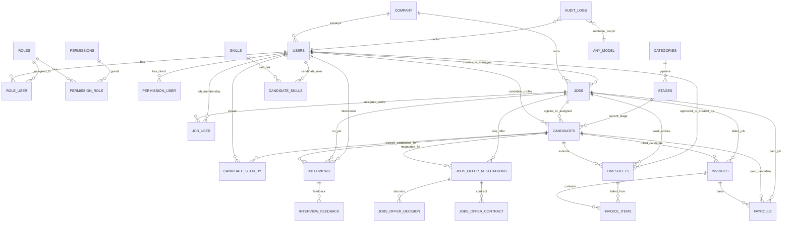

# Staffingo CRM - Project Analysis

This document gives a high-level analysis of the repository across:
1. Business logic
2. Project setup
3. Project flow
4. Database design (with ERD)

---

## 1) Business Logic

The project is a Laravel-based ATS/CRM platform with role-based behavior and package-based modules.

- **Primary actors**
  - Admin
  - Account Manager
  - Client User
  - Candidate

- **Core business domains**
  - **Authentication and role routing**: users are redirected to role-specific areas after login (admin portal vs client/candidate areas).
  - **Recruitment lifecycle**:
    - Job creation and management
    - Candidate creation/import and profile enrichment (skills, documents, statuses)
    - Candidate-job mapping, pipeline stage progression, notes, and interview tracking
  - **Offer lifecycle**:
    - Negotiation, decision, and contract-related records
  - **Operations and finance**:
    - Timesheet submission/approval
    - Invoice generation with invoice items
    - Payroll records connected to candidate/job context
  - **Integrations**:
    - Microsoft OAuth/token-based integration
    - RingCentral call-related logging
  - **Cross-cutting concerns**:
    - Multi-tenant-aware data modeling (`tenant_id` usage)
    - Auditing of model changes (audit log records)

---

## 2) Project Setup

## Tech Stack

- **Backend**: Laravel 8 (PHP `^7.3|^8.0`)
- **Frontend build**:
  - Root app: Laravel Mix
  - Package UIs: Vite (`packages/admin`, `packages/specialty`)
- **Database**: MySQL-style migration design (Laravel migrations)
- **Auth/tests**: Laravel auth scaffold + PHPUnit

## Initial Setup

From project root:

```bash
composer install
cp .env.example .env
php artisan key:generate
php artisan migrate
php artisan serve
```

Install and build frontend assets:

```bash
npm install
npm run dev
```

Package-specific UIs:

```bash
cd packages/admin
npm install
npm run dev
```

```bash
cd packages/specialty
npm install
npm run dev
```

## Useful Commands

```bash
php artisan test
vendor/bin/phpunit
npm run prod
```

Note: The repository uses both Mix and Vite workflows, so local team setup often runs backend + one or more frontend processes in parallel.

---

## 3) Project Flow

## A. Runtime Request Flow

1. Request enters Laravel kernel middleware stack.
2. Global middleware executes (including custom sanitizer and standard Laravel middleware).
3. Route resolution happens via:
   - Base routes (`routes/web.php`, `routes/api.php`)
   - Package routes loaded through Span providers (`config/span.php`).
4. Authentication and role checks happen via auth controllers/middleware.
5. Controller/service layer processes business action.
6. Eloquent models persist data and trigger model hooks/traits.
7. Response returns as blade/web or JSON API.

## B. User Journey (Typical ATS + Billing)

1. Admin/Account Manager logs in.
2. Job is created and published internally.
3. Candidate profile is created/imported and linked to a job.
4. Candidate moves across stages, interviews are scheduled, notes/feedback are captured.
5. Offer records are managed (negotiation -> decision -> contract).
6. Timesheets are created and approved.
7. Invoices and invoice items are generated.
8. Payroll records are produced/linked.

## C. Modular Flow

- `packages/admin`: admin-focused APIs and admin UI flows.
- `packages/specialty`: client/candidate-facing flows.
- Root app coordinates shared auth, middleware, models, migrations, and common services.

---

## 4) Database Design and ERD

## Design Overview

Main schema groups:

- **Identity and authorization**
  - `users`, `roles`, `permissions`
  - Pivot tables: `role_user`, `permission_role`, `permission_user`

- **Recruitment**
  - `jobs`, `candidates`, `stages`, `categories`
  - Relationship helpers: `job_user`, `candidate_seen_by`
  - Supporting entities: `notes`, `skills`, `candidate_skills`, interviews and feedback

- **Offer and assignment**
  - `jobs_offer_negotiations`, `jobs_offer_decision`, `jobs_offer_contract`

- **Finance**
  - `timesheets`, `invoices`, `invoice_items`, `payrolls`

- **Operational/support**
  - `service_calls`/call logs, `drives`, `audit_logs`, `options`, etc.

Important: several relationships appear logically in code by IDs even where strict DB-level foreign keys are not consistently enforced in all migrations.

## ERD (Logical, High-Level)



---

## Notes and Limitations

- This analysis is based on repository structure, route/controller patterns, and migration/model naming.
- Because there are many files and active changes in this repo, treat this document as a **high-level architecture baseline**.
- For strict implementation-level documentation, generate module-level docs next (Admin APIs, Specialty APIs, and schema dictionary per table).
